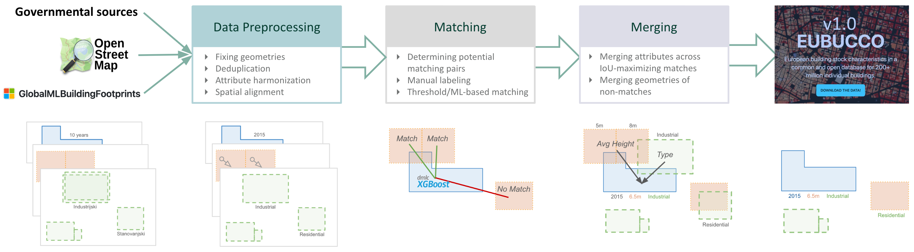

# EUBUCCO Conflation

A machine learning pipeline for conflating building datasets from multiple sources (Governmental, OpenStreetMap, Microsoft) to create a unified European building database.




## Local Setup

Astral [uv](https://docs.astral.sh/uv/) is used for package and dependency mangement.

### Install
Install dependencies and create a virtual environment with:
```bash
uv sync
source .venv/bin/activate
```

### Usage

```python
from conflation.conflation import conflate

# Run conflation for parquet files named DE111.parquet
conflate(
    datasets=["gov", "osm", "msft"],
    region_id="DE111",
    data_dirs_input=["/path/to/gov", "/path/to/osm", "/path/to/msft"],
    data_dirs_matching=["/path/to/matching-fts-gov-osm", "/path/to/matching-fts-gov-osm-msft"],
    data_dir_results="/path/to/results",
    attribute_mapping=[True, True],
    h3_res=9,
    model_path="/path/to/model.json",
    db_version="1.0"
)
```


## Project Structure

```
├── conflation/                           # ------ Conflation package ------
│   ├── conflation.py                     # Main conflation pipeline
│   ├── alignment.py                      # Spatial alignment via rubbersheeting
│   ├── feateng.py                        # Feature engineering pipeline
│   ├── features.py                       # Feature definitons
│   ├── prediction.py                     # ML prediction interface
│   ├── merge.py                          # Attribute & footprint merging logic
│   └── geoutil.py                        # Utility functions
|
├── bin/                                  # ------ Scripts ------
│   ├── create-candidate-pairs*.py        # Sample candidate pairs for model training
│   ├── create-candidate-neighborhoods.py # Sample candidate pairs for model evaluation
│   ├── get-candidate-attributes.py       # Retrieve building attributes
│   └── submit-*.sh                       # Slurm submission scripts
|
├── slurm-pipeline/                       # ------ Slurm pipeline definition for HPC cluster ------
│   ├── config.yml                        # Job configuration
│   └── params-conflation.yml             # Job parameter grid
|
├── data/                                 # ------ Data directories ------
│   ├── aaai/                             # Data to reproduce AAAI analysis
│   ├── train/                            # Training data
│   └── val/                              # Validation data
|
└── tests/                                # Test suite
|
└── conflation-methods.ipynb              # Playground for developing matching methods
└── matching-assessment.ipynb             # Assessment of matching and merging logic (AAAI analysis)
```

### Key Features

- **Multi-source conflation**: Merges Government, OSM, and Microsoft building data
- **ML-based matching**: Uses XGBoost model for building footprint matching
- **Geometric alignment**: Corrects spatial misalignments between datasets (see `conflation/alignment.py`)
- **Attribute merging**: Intelligently combines building attributes from multiple sources (see `conflation/merging.py`)
- **Scalable processing**: Slurm-based HPC pipeline for large-scale processing (see `slurm-pipeline/`)
- **Quality assessment**: Comprehensive evaluation metrics and validation (see `matching-assessment.ipynb`)


## Reproducing AAAI analysis
To reproduce the AAAI analysis results, run the Jupyter notebook `matching-assessment.ipynb`. All required data is provided [^1][^2]:
```
├── data/
│   ├── aaai/
│   |   ├── buildings-{gov,osm,msft}.parquet     # Sample of Governmental, OSM, and Microsoft buildings used in evaluation (GeoParquet)
│   |   |── matching-pairs.parquet               # Candidate pairs w/ ground-truth labels for Gov-OSM, Gov-Msft, OSM-Msft matching
│   |   └── matching-pairs-eval.parquet          # Candidate pairs including calculated features, predictions, and threshold metrics
│   |   └── conflation-nuts-level-metrics.gpkg   # Regional summary stats of Europe-wide conflation
|   |
│   └── train/
│       └── xgboost-model.json                   # Parameters of trained XGBoost model

```

[^1]: Data of Europe-wide conflation assessments could not be provided due to data size limitations (>500GB). Only a summarizing stats file is provided (see `conflation-nuts-level-metrics.gpkg`).

[^2]: Model training data could not be provided due to data size limitations (>2.5GB), however, training labels are provided.